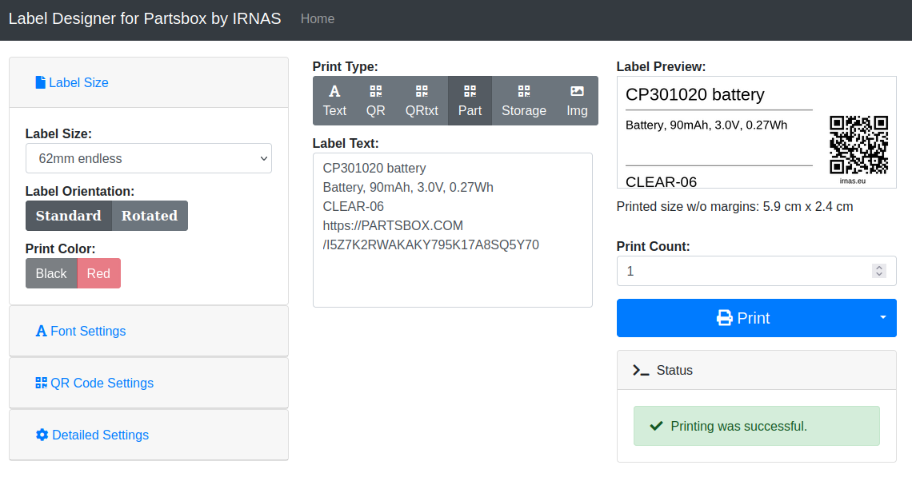

## brother\_ql\_web\partsbox

This is a web service to print labels in particula to use with [PartsBox](http://partsbox.com) Service on on Brother QL label printers. N0te: Higly experimental implementation presently with proof-of-code implementation - needs rework to support and validate most edge-cases.

You need Python 3 for this software to work.

The web interface is [responsive](https://en.wikipedia.org/wiki/Responsive_web_design).

### PartsBox features
PartsBox is a web service for tracking components and as such it is useful to print labels that attach to physical objects. As no API is available presently, the label printing only has a built it format which uses copy-paste data to the label text.

Parts tab uses the label text field as a 4 line entry where the lines get used as follows:
1. Manufacturer part number (large on top)
1. Part description (multi line in middle
1. Storage location (bottom)
1. PartsBox URL (QR code)

### Installation

This installation manual requires only a default installation of Debian 10 (Buster).
Install prerequisites:

    apt install fontconfig python3-venv python3-pip git poppler-utils

Get the code:

    cd /opt
    git clone https://github.com/IRNAS/brother_ql_web.git

Build the venv and install the requirements:

    cd /opt/brother_ql_web
    python3 -m venv .venv
    source /opt/brother_ql_web/.venv/bin/activate
    pip install -r requirements.txt

### Configuration file

Create a directory called 'instance', a file called 'application.py' and adjust the values to match your needs.

    mkdir /opt/brother_ql_web/instance
    touch /opt/brother_ql_web/instance/application.py

E.g.
    """
    User specific application settings
    """
    import logging
    PRINTER_MODEL = 'QL-820NWB'
    PRINTER_PRINTER = 'tcp://192.168.1.33:9100'

### Startup

To start the server, run `./run.py`.

### Automatic startup using systemd service

Copy service file, reload system, enable and start the service

    cp /opt/brother_ql_web/systemd/brother_ql_web.service /etc/systemd/system
    systemctl daemon-reload
    systemctl enable brother_ql_web
    systemctl start brother_ql_web

### Usage

Once it's running, access the web interface by opening the page with your browser.
If you run it on your local machine, go to <http://localhost:8013>.
You will then be forwarded by default to the interactive web gui located at `/labeldesigner`.

All in all, the web server offers:

* a Web GUI allowing you to print your labels at `/labeldesigner`,
* an API at `/api/print/text?text=Your_Text&font_size=100&font_family=Minion%20Pro%20(%20Semibold%20)`
  to print a label containing 'Your Text' with the specified font properties.

### License

This software is published under the terms of the GPLv3, see the LICENSE file in the repository.

Parts of this package are redistributed software products from 3rd parties. They are subject to different licenses:

* [Bootstrap](https://github.com/twbs/bootstrap), MIT License
* [Font Awesome](https://github.com/FortAwesome/Font-Awesome), CC BY 4.0 License
* [jQuery](https://github.com/jquery/jquery), MIT License

### Credits
This repository is a fork of https://github.com/tbnobody/brother_ql_web and has merged useful components and concepts from https://gist.github.com/pojda/8bf989a0556845aaf4662cd34f21d269  Awesome work without which this would not be possible.
